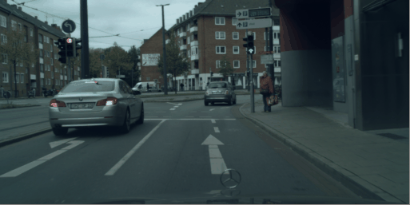
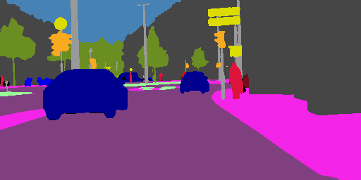
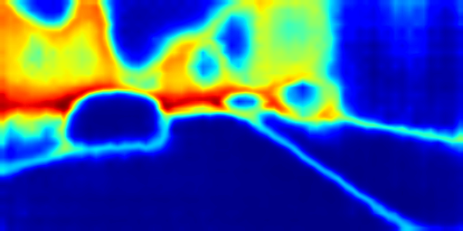

# Probabilistic Future Prediction for Video Scene Understanding
Unofficial implementation of arXiv:2003.06409 "Probabilistic Future Prediction for Video Scene Understanding"

## Our Results

| Groundtruth Frames             |  Groundtruth Segmentation | Prediction | Entropy (Uncertainty) |
:-------------------------:|:-------------------------:|:-------------------------:|:-------------------------:
 |  |  | 

This is a work-in-progress. Code will be added soon, stay tuned!

Contact: info AT chengxin.de
