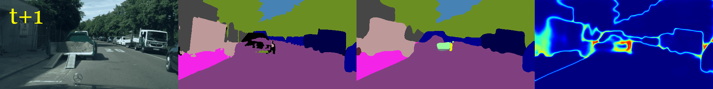

# Recurrent Future Prediction with Spatiotemporal GANs for Video Scene Understanding

In this repository we provide the official PyTorch implementation of our network.

Author: [Chengxin Wang](https://chengxin.de)

Supervisors: [Juana Valeria Hurtado](http://rl.uni-freiburg.de/people/hurtado) and [Prof. Dr. Abhinav Valada](http://rl.uni-freiburg.de/people/valada)

# Key Results

Given only 5 past RGB images as a context, our network can predict future semantic segmentation for a large variety
of senarios:

Note the model have no knowledge of the future RGB frame nor future semantic segmentation during test time, and they are given here only for comparison.

(From left to right: future RGB frame, oracle semantic segmentation, model prediction, prediction uncertainty)

**Slight Right**

**Going Straight**

**Agent Movement (pedestrian walking in opposite direction)**

**Agent-object Interaction (riding a bike)**


Quantitively, our network can achieve a state-of-the-art prediction mIoU for both mid-term (5th future frame)
and long-term (10th future frame) prediction:

| Experiment Name               | mIoU 5  | mIoU 5 (RF) | mIoU 10 | mIoU 10 (RF) | Weight                                                                                                                          | Configuration                                    |
| ----------------------------- | ------- | ----------- | ------- | ------------ | ------------------------------------------------------------------------------------------------------------------------------- | ------------------------------------------------ |
| ResNet                        | 47.18 % | 42.17 %     | 41.82 % | 35.69 %      | [pth](https://futureprediction-backup.s3.eu-central-1.amazonaws.com/models/pd_os8_dtm_noflow_4ds_batchnorm/best_model.pth)      | [config](config/forecast/pandeep.yml)            |
| ResNet + Discriminator        | 49.57 % | 42.98 %     | 43.64 % | 36.14 %      | [pth](https://futureprediction-backup.s3.eu-central-1.amazonaws.com/models/pd_os8_dtm_noflow_gan_video_4ds/best_model_4397.pth) | [config](config/forecast/pandeep_stgan.yml)      |
| ResNet + Discriminator + F2MF | 49.62 % | 42.83 %     | 44.36 % | 35.98 %      | [pth](https://futureprediction-backup.s3.eu-central-1.amazonaws.com/models/pd_os8_dtm_blend_gan_video_4ds/best_model-5.pth)     | [config](config/forecast/pandeep_stgan_f2mf.yml) |
| EfficientPS-FPN               | 52.26 % | 44.68 %     | 46.51 % | 37.41 %      | [pth](https://futureprediction-backup.s3.eu-central-1.amazonaws.com/models/eps_dtm_noflow_4ds/best_model_9.pth)                 | [config](config/forecast/efficientps_fpn.yml)    |


For this project, the following single-frame perception encoders are used:

| Encoder Name                       | Input HxW | Single-frame mIoU | Training Data         | Model                                                                                                                                                                                                                                                                        |
| ---------------------------------- | --------- | ----------------- | --------------------- | ----------------------------------------------------------------------------------------------------------------------------------------------------------------------------------------------------------------------------------------------------------------------------- |
| Panoptic Deeplab (finetuned, OS=8) | 257x513   | 65.97 %           | ImageNet + Cityscapes | [pth](https://futureprediction-backup.s3.eu-central-1.amazonaws.com/perception_models/panoptic_deeplab_R50_os8_cityscapes_1_4_ds.pth), [yaml](https://futureprediction-backup.s3.eu-central-1.amazonaws.com/perception_models/panoptic_deeplab_R50_os8_cityscapes_1_4_ds.pth) |
| EfficientPS (not finetuned, FPN)   | 256x512   | 59.52 %           | -                     | [pth](https://futureprediction-backup.s3.eu-central-1.amazonaws.com/perception_models/efficientps/model_best_depth_train_run26_1.pth), [ini](https://futureprediction-backup.s3.eu-central-1.amazonaws.com/perception_models/efficientps/perception_run80_4_city_full.ini)     |

# Getting Started

## Code Setup

### Main Code
```
git clone --recurse-submodules git@github.com:cvcore/fr-panoptic-forecast.git
cd fr-panoptic-forecast
```

Then, use `conda` to install required packages:
```
conda env create -f envs/env_pytorch_1_7_1_cupy.yml
```

Next, install the main package with pip:

```
pip install -e .
```

### Dependencies

```
export CUDA_PATH=/usr/local/cuda # or your cuda installation path
pushd thirdparty/correlation_package
pip install -e .
popd

pushd thirdparty/resample2d_package
pip install -e .
popd

pushd thirdparty/panoptic_deeplab
pip install -e .
popd
```

(Optional: EfficientPS encoder)

To use FPN network from EfficientPS as perception encoder, install
it by:
```
pushd thirdparty/efficientPS
pip install -e .
popd
```

## Dataset Setup

### Download the Cityscapes Dataset

Please use the [official website](https://www.cityscapes-dataset.com). For our experiment, the following packages are required:

- gtFine_trainvaltest.zip (241MB)
- leftImg8bit_trainvaltest.zip (11GB)
- leftImg8bit_sequence_trainvaltest.zip (324GB)

By default we assume the dataset is put under `../../dataset/cityscapes` relative to this project folder. You can also change it with
the `DATASET.PATH` option.

### Download Pseudo-groundtruth Semantic Segmentation Labels

Because fine annotation is available only for the 20th frame from the Cityscapes dataset, we have generated pseudo-groundtruth semantic segmentaiton labels with the [EfficientPS](https://github.com/DeepSceneSeg/EfficientPS) network. They can be downloaded from (TODO)[TODO] and should be put under `gtPseudoSeqEPS/` directory in the Cityscapes dataset folder.

## Download the Pretrained Perception Models

[Download](https://futureprediction-backup.s3.eu-central-1.amazonaws.com/perception_models/perception.tar.gz) the single-frame perception backbones and unzip it under `pretrained_models/perception` relative to the project directory.

## FAQs

**error in correlation_forward_cuda_kernel: invalid device function**

Make sure your CUDA runtime version reported by `nvcc --version` agrees with your pytorch version shown in `conda list`.

**can't install correlation_package**

Set `CUDA_HOME` to your cuda installation path (usually `/usr/local/cuda-VERSION`).

# Running the Code

## Training

Training is done with `scripts/train_forecast.py` with the following commands:

**Single GPU training**

```
python scripts/train_forecast.py CONFIG_FILE [--opts OPTIONAL_ARGUMENTS]
```

**Multi-GPU distributed training**

```
python -m torch.distributed.launch --nproc_per_node=NUM_GPUS --use_env scripts/train_forecast.py CONFIG_FILE --opts MODEL.DISTRIBUTED True [OTHER_OPTIONAL_ARGUMENTS]
```

Each `CONFIG_FILE` defines an experiment setup and its documentation can be found in [`config/forecast.py`](src/futurepred/config/forecast.py) (where default setting for each key is defined).

For our setup, we have trained the model with 4x NVIDIA GeForce RTX 3090 (24 GB memory each) around 4 days. For a good learning outcome, we recommend a minimum batch size of 12.

## Evaluation

Evaluation is done with `scripts/train_forecast.py` by loading the pretrained model and setting `MODEL.EVAL` to `True`:

**Single GPU evaluation**

```
python scripts/train_forecast.py CONFIG_FILE --opts MODEL.DISTRIBUTED True MODEL.EVAL True MODEL.LOAD CHECKPOINT_FILE [OTHER_OPTIONAL_ARGUMENTS]
```

**Multi-GPU evaluation**

```
python -m torch.distributed.launch --nproc_per_node=2 --use_env scripts/train_forecast.py CONFIG_FILE --opts MODEL.DISTRIBUTED True MODEL.EVAL True MODEL.LOAD CHECKPOINT_FILE [OTHER_OPTIONAL_ARGUMENTS]
```

# Reference

If you find this implementation useful in your work, please acknowledge it appropriately:

```
@misc{future-prediction,
  author = {Chengxin Wang},
  title = {Recurrent Future Prediction with Spatiotemporal GANs for Video Scene Understanding in PyTorch},
  year = {2020},
  publisher = {GitHub},
  journal = {GitHub repository},
  howpublished = {\url{https://github.com/cvcore/fr-panoptic-forecast}
}
```

# Acknowledgements

We thank the developers of the following projects:

- [EfficientPS](https://github.com/DeepSceneSeg/EfficientPS)
- [Panoptic-Deeplab](https://github.com/bowenc0221/panoptic-deeplab)
- [Weights & Biases](https://wandb.ai/)

# License

Apache License Version 2.0
